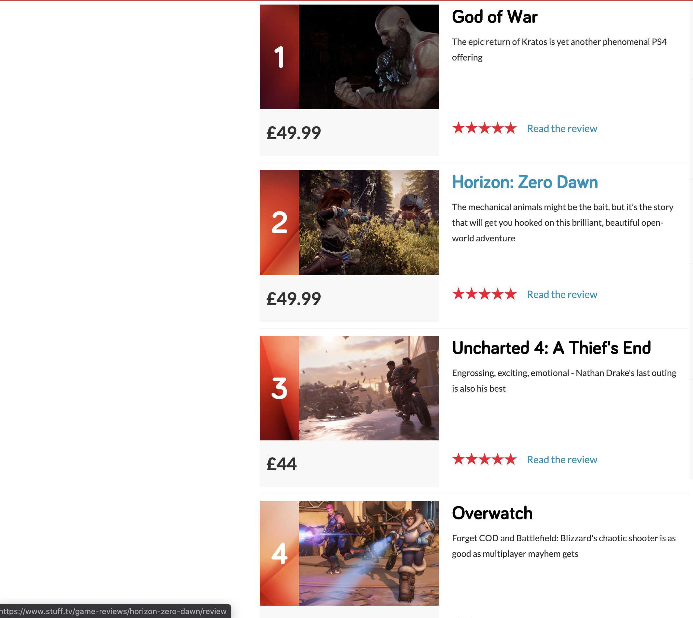
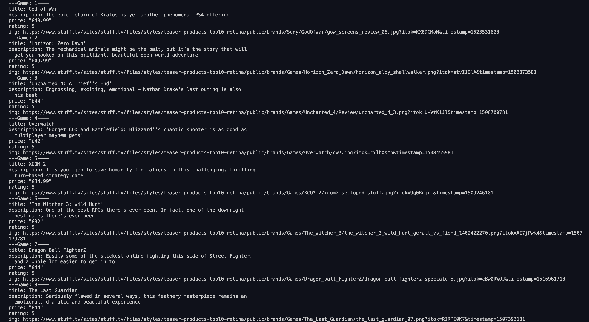

# Capstone Ruby project

> Scrapper of Website **[@TOP 10 PS4 GAMES](https://www.stuff.tv/top-10/playstation-4-games)**

## Built With

- Ruby
- Gems used : `nokogiri`,`yaml`,`open-uri`

## Getting Started 
- Once you had downloaded the repo run command `bundle install`
- Navigate to the `bin` folder.
- Run command `ruby main`

## Authors

👤 **Fernando**

- Github: [@Ferm0494](https://github.com/Ferm0494)
- Twitter: [@ferm494](https://twitter.com/rivas0494)
- Linkedin: [@Ferm0494](https://www.linkedin.com/in/ferm0494/)

## 🤝 Contributing

Contributions, issues and feature requests are welcome!

Feel free to check the [issues page](issues/).

## Show your support

Give a ⭐️ if you like this project!

## 📝 License

This project is [MIT](lic.url) licensed.
